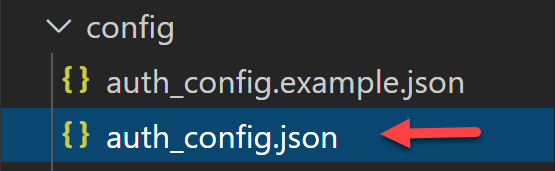
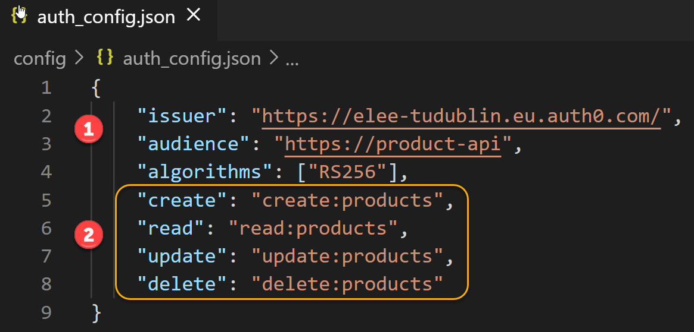
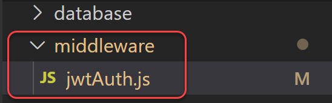
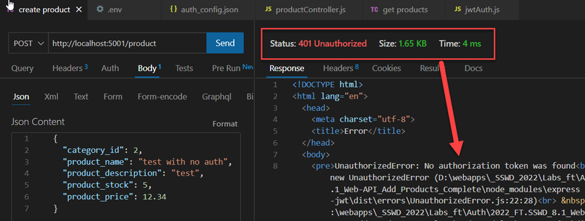
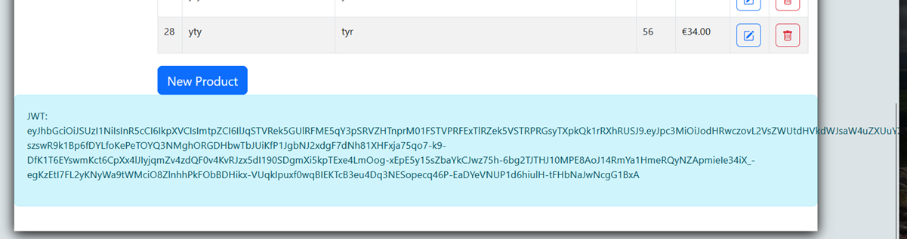
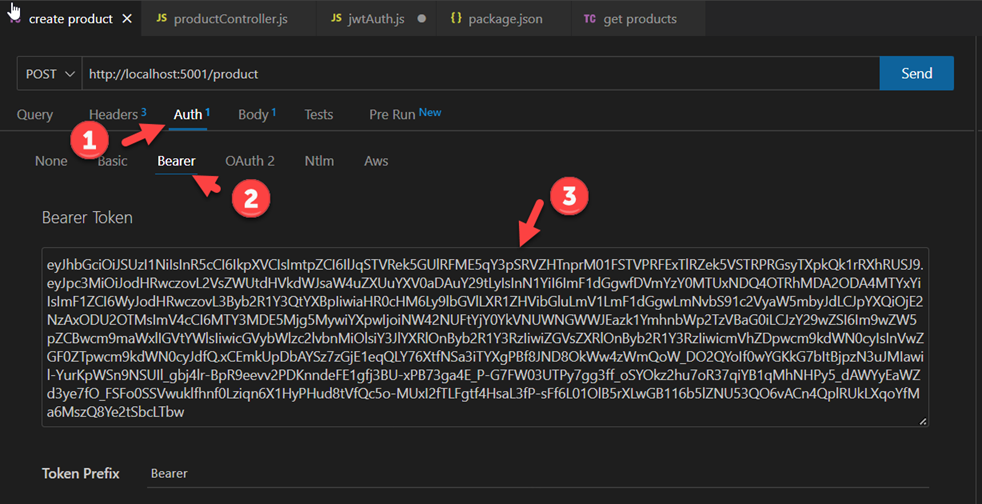
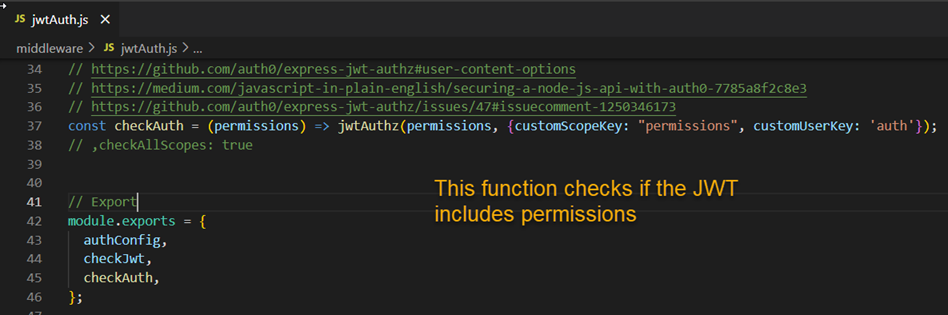

# 8.3 Web API Lab: Access Control - Server API Setup
*Enda Lee 2022*

### Quick Start

1. Download or `fork` the code from this repository.
2. Open in VS Code.
3. copy `sample.env` to `.env` and configure for your database.
4. In a terminal run `npm install`
5. Start the application using `npm run dev`


## Introduction

The next step is to configure the `server API` so that it can control access to routes using the `access token` provided by `Auth0`. **It is extremely important to control access on the server side as well as in the client**.

The access control will be configured as `Middleware` which will perform user authentication and authorisation before protected controller functions are executed.

## Prerequisites

You should have registered for an Auth0 account and configured an API, Web application, Users, and roles before continuing. 

## 1. Configuration and Setup

Start by adding a configuration file to store values from the Auth0 API setup in the previous step. **Import: Use your own application settings**

Add auth_config.json to the config folder (or rename the example file).


The required settings can be found in the Auth0 dashboard. Choose the Product API App created earlier then open Quick Start and choose Node.js. Here you will find the values for audience, issuer, and the crypto algorithms. Note that these are app specific, so it is important to use the value for your app.


Add your values to auth_config.json. Also add the configured permissions (permissions tab in the Auth0 API settings).

Using a configuration file for these values makes changes easier if required.


## 2. The Auth Middleware

Next define the Middleware which will be responsible for authentication and authorization. It will use the Auth0 services, and the configuration value above to verify a user’s access token as required.

### Install Required Dependencies
Use npm to install the following required dependencies. Search <https://www.npmjs.com/> for more details about these packages.

```bash
npm install express-jwt jwks-rsa express-jwt-authz
```


### Define the JWT Auth Middleware

Add a new folder, named middleware, to the root of the app. Then add a new file named jwtAuth.js to the folder.


The code is modified from the Auth0 Quick Start example for Node.js with the addition of an authorisation check, using `express-jwt-autz` to compare required permissions with those contained in a JWT.

Read the comments for details.

##### `middleware/jwtAuth.js`

```javascript
// Dependencies
const jwt = require("express-jwt");
const jwksRsa = require("jwks-rsa");
const jwtAuthz = require('express-jwt-authz');

// Load the configuration settings
const authConfig = require("../config/auth_config.json");
 
// Authentication
//
// create the JWT middleware (these checks happen BEFORE controller endpoints)
const checkJwt = jwt({
    // Gets the JSON Web Key Set which will be used to verify the access token and issuer.
    // Sets other required parameters including the algorithm to be used
    // including the Public Key required to verify a JWT
    secret: jwksRsa.expressJwtSecret({
      cache: true,
      rateLimit: true,
      jwksRequestsPerMinute: 5,
      jwksUri: `${authConfig.issuer}.well-known/jwks.json`
    }),
  // 
    audience: authConfig.audience,
    scope: 'openid email profile',
    issuer: authConfig.issuer,
    algorithms: authConfig.algorithms
  });

//
// Authorisation
// Verify that the JWT includes scpecific permissions (from the JWT), passed as a parameter
//
// https://github.com/auth0/express-jwt-authz#user-content-options
// https://medium.com/javascript-in-plain-english/securing-a-node-js-api-with-auth0-7785a8f2c8e3
const checkAuth = (permissions) => jwtAuthz(permissions, {customScopeKey: "permissions" });
// ,checkAllScopes: true 

// Export
module.exports = {
  authConfig,
  checkJwt,
  checkAuth,
};
```

Note the authorisation check examines the **`permissions`** key of the `JWT`, as defined by the **`customScopeKey`**.

## 3. Protecting the productController functions

Now that the middleware has been defined, it can be used to control access to the controller to:

1.  Ensure that the user is authenticated (if required).

2.  Ensure that the user is authorised before allowing access.

Note that authorisation is only every carried out after authentication has succeeded. There is no point authorising a user who cannot be identified!

Start by importing the middleware in productController.js:


Now the routes can be protected. In this example we will require authentication for the create, update, and delete routes. In addition, we can check if the user has the required permissions. Here the create (POST) route:

Read comments for details:


Note the addition of the middleware functions checkJwt and checkAuth.

### Testing the API
### 1. No Auth

Try to add a new product using Thunder Client, what was the result? You should see:


Also testing with the client application. Verify that authentication and authorization checks work as expected.


### 2. With Auth

Open the Client App, log in as Admin, and copy the JWT from the console or bottom of the page.



 

After copying, go back to Thunder Client in the API application. Then add a `Bearer Token` to the `Auth` header:



Finally send the request. Was the product added?

The API used the `checkAuth` function to verify that the `JWT` contained the required permissions, i.e., `create:products`




## 4. Configure the Client Application to send the JWT with requests


### 4.1 Modify Product Store Functions

Modify the `initRequest` function so that it accepts the token as a parameter and sets the Auth header (Bearer Token)

```javascript
//
// Used to Initialise  requests
// parameters: http method,  body content, and Auth token. note default values)
const initRequest = (http_method = 'GET', body_data = '', access_token = '') => {

    let request = {
        method: http_method,
        // credentials: 'include',
        headers: {
            "Accept": "application/json",
            "Content-Type": "application/json",
            // Set the Auth Header
            "Authorization": `Bearer ${access_token}`
        },
        mode: 'cors',
        cache: 'default',
    };

    if (body_data) {
        request.body = body_data;
    }

    return request;
};

```


Modify the other functions so that they accept the token as a parameter and use it in API requests:

```javascript
// Function to get all products from the api
// sets the products store
export const getAllProducts = async (token='') => {

    const data = await getAPIData('/product', initRequest('GET', '', token));
    products.set(data);
};

// Function to get all categories from the api
// sets the categories store
export const getAllCategories= async (token='') => {

    const data = await getAPIData('/category', initRequest('GET', '', token));
    categories.set(data);     

};


// Function to get products in a category (by category id)
// sets the products store
export const getProductsByCat= async (cat_id = 0, token='') => {

    // 
    if (cat_id > 0) {
        const data = await getAPIData(`/product/bycat/${cat_id}`, initRequest('GET', '', token));
        categories.set(data);
    } else {
        getAllProducts();
    }

};

// Add a new product by sending a POST request to the API
export const addNewProduct= async (product = '', token='') => {

    if (product) {
        // build the request using the intRequest function
        const request = initRequest('POST', product, token);

        // Make th request via getAPIData() function
        const result = await getAPIData('/product', request);

        // refresh the store
        getAllProducts();

        // return the API result
        return result;

      // In case of error  
    } else {
        console.log('Store: Add new product failed: missing product');
    }
}

// To do - update an existing product
export const updateProduct = async (product = '', token='') => {

    if (product) {
        // build the request using the intRequest function
        const request = initRequest('PUT', product, token);
    }

}

// To do - delete an existing product by id
// id set to 0 by default
export const deleteProductById = async (id = 0, token='') => {

    if (id > 0) {
        // build the request using the intRequest function
        const request = initRequest('DELETE', '', token);
    }

}

```


### 4.2 Send the token when adding a new product:

`routes/addproduct/+page.svelte` Include the token in a hidden field in the form.

```html
				</div>
				<!-- productId is a hidden field value is not required but set = 0-->
				<input name="id" type="hidden" value="0" />
				<input name="token" type="hidden" value="{$token}" />
				<div class="mb-3">
					<button type="submit" class="btn btn-primary"> Add Product </button>
					<a href="/" class="btn btn-secondary"> Cancel </a>
				</div>

				{#if form?.error}
					<div class="alert alert-danger col-sm-8" role="alert">validation failed: {form?.message}</div>
				{/if}
			</form>
			<!-- End form-->
```

The token is imported from the Auth Store in the script section

```html
<script>

	// import required Sveltekit form features
	import { enhance, applyAction } from '$app/forms';

	// Import the store etc.
	import { isAuthenticated, token } from '../../stores/authStore';
	import { categories, getAllCategories } from '../../stores/productStore.js';
```


`routes/addproduct/+page.server.js` Include the token in a hidden field in the form.

Read the token from body data and include it as a parameter when calling `addNewProduct()`

```javascript
 // read the token
      const token = form_data.get('token');


      // Basic validation
      if (product.category_id > 0 &&
          product.product_name != '' &&
          product.product_description != '' &&
          product.product_stock > 0 &&
          product.product_price > 0 &&
          token != ''
          
      ) {

          // Add the new product via the API (using the product store function)
          const result = await addNewProduct(JSON.stringify(product), token);
          console.log('add product result: ', result)
```


## 5 Exercises

Setup access control for update and delete.


------

Enda Lee 2022
